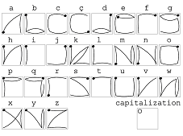

# EdgeWrite Keyboard

A library that provides a swipeable keyboard using the EdgeWrite system https://depts.washington.edu/ewrite/

Swipe from corner to corner to enter characters and press the button to submit the text to the calling app. Letters can be capitalised by finishing the stroke in the top left corner. 

For a full character chart see [EwChart.pdf](EwChart.pdf)

**Supported:** Letters (including capitals), numbers, backspace, word backspace, space, punctuation, new line, and some cursor controls (left, right, word left/right, home, end).

**Unsupported:** Extended mode, accents, cursor controls, and word-level stroking.

