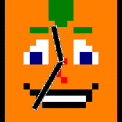
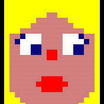
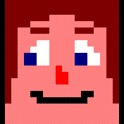
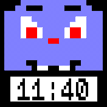
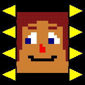
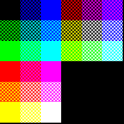

#  Tinyheads

### Which Tinyhead will you create?

Choose from a selection of hair, eyes, noses and mouths to create your own pixel art style Tinyhead.

## Features

* Facial features
    * Many different hairstyles, eyes, noses, and mouths to choose from
    * Choice of 27 colours
    * Fully customisable on the Bangle.js itself
* Optional widget display
* Optional analog clock hands
* Optional digital clock
* Eyes can indicate charging or loss of bluetooth connection

## Usage

* Install Tinyheads Clock through the Bangle.js app loader.
* Configure it either through the default Bangle.js configuration mechanism
(Settings app, "Apps" menu, "Tinyheads clock" submenu) or by touching the screen for a few seconds.
* If you like it, make it your default watch face
(Settings app, "System" menu, "Clock" submenu, select "Tinyheads clock").
* If your Tinyhead is struggling to keep it's eyes open then your battery is low (<10%)
* When charging your Tinyhead will have a little sleep (eyes remain close)

## Configuration

If accesing settings via the standard method (settings app) you will see a list of configuration options. Accessing settings via a long press on the Tinyhead will take you directly to the face editing screen. Pressing the button while on this screen will take you back to the configuration list.

### Configuration options

* **Face** - Select the facial features and colours (see below).
* **Analog Clock** - Analog clock hands shown over the Tinyhead. Default is on.
    * **Off**
    * **On**
    * **Unlocked** - Clock will only be displayed while the Bangle.js screen is unlocked.
* **Analog Colour** - The colour of the analog clock hands (Black, White, Red, Green, Blue, Yellow, Cyan). Default is white.
* **Digital Clock** - A digital clock area shown over the Tinyhead, in either 12 or 24 hour time depending on the global Bangle.js setting. When displayed the position of the Tinyhead and analog hands will adjust slightly. Default is off.
    * **Off**
    * **On**
    * **Unlocked** - Clock will only be displayed while the Bangle.js screen is unlocked.
* **Digital Position** - The position of the digital clock area on the screen. Default is bottom.
    * **Top**
    * **Bottom**
* **Show Widgets** - If the Bangle.js widget area should be shown. Default is off.
    * **Off**
    * **On**
    * **Unlocked** - Widget bar will only appear while the Bangle.js screen is unlocked.
* **BT Status Eyes** - When selected eyes will point in different directions if the Bangle.js becomes disconnected from bluetooth. Default is on.

### Face editing

Selecting **Face** from the settings screen, or long pressing the Tinyhead, will take you to the face editing screen.

* Faces have 4 features, from top to bottom these are -
    * Hair
    * Eyes
    * Nose
    * Mouth
* These are changed by using the arrows next to each feature.
* Tapping the feature itself will open the colour selector.
    * Tap a colour to select it.
    * If the wrong colour is accidentally selected it can be changed by quickly tapping on the correct colour.
    * The chosen colour will be applied to the facial feature after a short pause.
* A long press anywhere on the face will open the colour selector for the skin colour.
* Pressing the button while on the colour selector will return without changing the colour.
* Pressing the button while on the face edit screen will set the face and return to the main settings screen.
* Depending on how the settings were accessed, pressing the button will exit to either the Bangle.js settings app or the Tinyheads clock.

## Author

Woogal [github](https://github.com/retcurve)
